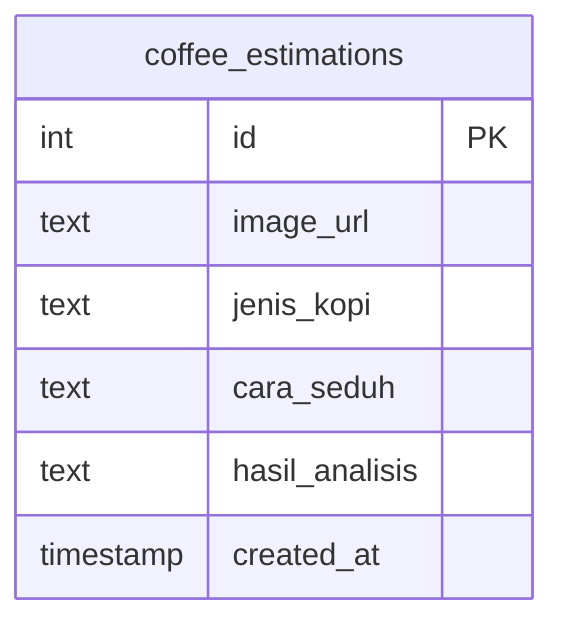

# ☕ CoffeeSense AI

> Platform cerdas berbasis AI untuk analisis rasa kopi dan rekomendasi penyeduhan — memanfaatkan **Supabase**, **OpenRouter (GPT-4o-mini)**, dan interface modern bergaya ChatGPT.

---

## 🚀 Fitur Utama

### 1. **Upload & Analisis Gambar Kopi**
- Pengguna dapat mengunggah foto biji atau bubuk kopi.
- Gambar disimpan di **Supabase Storage**.
- Data jenis kopi dan metode seduh tersimpan otomatis di tabel `coffee_estimations`.
- AI akan memberikan analisis mendalam (profil rasa, karakter unik, rekomendasi alat & suhu seduh, hingga kesimpulan elegan).

### 2. **Input Manual Tanpa Gambar**
- Pengguna juga dapat mengisi manual: `jenis kopi` dan `cara seduh`.
- Tetap mendapatkan rekomendasi analisis lengkap dari model GPT-4o-mini tanpa perlu gambar.

### 3. **UI Gaya ChatGPT 5D Bubble Warp 💬**
- Tampilan interaktif dengan bubble chat bergaya *5D glass morphism*.
- Setiap respons AI tampil seperti percakapan profesional antara barista dan pengguna.
- Mendukung format Markdown (`**bold**`, list, heading, emoji, dsb.).

### 4. **Integrasi OpenRouter GPT-4o-mini**
- Model AI digunakan untuk analisis rasa & deskripsi rekomendasi kopi.
- Hasil outputnya diformat menyerupai respon ChatGPT — elegan, natural, dan kontekstual.

### 5. **Database Supabase Realtime**
- Data disimpan dan dapat dimonitor melalui tabel `coffee_estimations`.
- Realtime update untuk setiap upload atau input manual.

---

## 🧩 ERD Database



**Relasi:**
- Tabel `coffee_estimations` berdiri sendiri.
- Setiap baris menyimpan satu hasil analisis kopi dari user (upload atau input manual).

---

## 🔄 Flowchart Sistem Analisis Kopi

```ascii
                   ┌────────────────────────┐
                   │   📸 Upload Gambar / ✍️ Input Manual │
                   └────────────┬───────────┘
                                │
                                ▼
                  ┌────────────────────────┐
                  │  Validasi Input (File, Jenis, Seduh) │
                  └────────────┬───────────┘
                                │
                                ▼
             ┌──────────────────────────────┐
             │ Upload ke Supabase Storage    │
             │ Simpan ke coffee_estimations  │
             └────────────┬─────────────────┘
                                │
                                ▼
           ┌────────────────────────────────────┐
           │ Kirim prompt ke OpenRouter GPT-4o-mini │
           │ (Analisis rasa, aroma, rekomendasi) │
           └────────────┬───────────────────────┘
                                │
                                ▼
               ┌──────────────────────────────────┐
               │ AI Response → Format Markdown    │
               │ Tampil dalam UI bubble 5D        │
               └──────────────────────────────────┘
```

---

## ⚙️ Cara Instalasi & Setup

### 1. **Clone Repository**
```bash
git clone https://github.com/username/coffeesense-ai.git
cd coffeesense-ai
```

### 2. **Instal Dependensi**
```bash
npm install
```

### 3. **Buat File `.env.local`**
Tambahkan konfigurasi Supabase & OpenRouter kamu:
```bash
NEXT_PUBLIC_SUPABASE_URL=your_supabase_url
NEXT_PUBLIC_SUPABASE_ANON_KEY=your_supabase_key
OPENROUTER_API_KEY=your_openrouter_key
```

> Pastikan file `.env.local` **terdaftar di `.gitignore`** agar tidak ikut diupload ke GitHub atau Vercel.

### 4. **Jalankan Secara Lokal**
```bash
npm run dev
```
Lalu buka di browser → [http://localhost:3000](http://localhost:3000)

---

## 📁 Struktur Folder
```
📦 coffeesense-ai
 ┣ 📂 components
 ┃ ┗ 📜 CameraScan.jsx   # Komponen utama upload & analisis
 ┣ 📂 lib
 ┃ ┗ 📜 supabase.js      # Koneksi Supabase client
 ┣ 📜 .gitignore          # File ignore environment & build
 ┣ 📜 package.json        # Dependensi proyek
 ┣ 📜 README.md           # Dokumentasi proyek
 ┗ 📜 next.config.js      # Konfigurasi Next.js
```

---

## 🧠 Teknologi yang Digunakan
- **Next.js 14+** — framework React modern.
- **Supabase** — database & storage real-time.
- **OpenRouter (GPT-4o-mini)** — AI analisis rasa kopi.
- **React Markdown** — render hasil analisis AI dalam format markdown.
- **TailwindCSS + Framer Motion** — efek animasi & bubble 5D.

---

## 💬 Contoh Output AI
```
## ☕ Profil Rasa
Kopi Arabika Gayo ini memiliki aroma floral dan cokelat gelap.

## ⚙️ Rekomendasi Seduh
Metode terbaik: V60 Dripper (rasio 1:15, suhu 93°C).

## ✨ Kesimpulan
Kopi ini seperti jazz di dalam cangkir — lembut, kompleks, dan elegan.
```

---

## 🔒 Keamanan & Deployment
- File `.env.local` otomatis diabaikan oleh `.gitignore`.
- Dapat di-deploy ke **Vercel** atau **Netlify** tanpa memaparkan API keys.

```bash
git add .
git commit -m "Initial commit: CoffeeSense AI"
git push origin main
```
Kemudian deploy via Vercel CLI atau dashboard.

---

## 👨‍🔬 Kontributor
- **Jojo Hyper Backend** — AI & backend architecture.
- **ChatGPT (OpenRouter)** — AI Assistant & analisis natural-language.

---

## ☕ Lisensi
MIT License — silakan gunakan, modifikasi, dan kembangkan lebih lanjut untuk project AI kopi kamu sendiri.